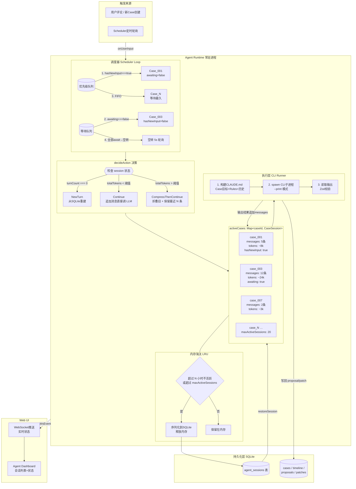

# Agent Runtime 多 Case 调度架构图

> 对应文档：`docs/agent/agent-runtime.md` §3 架构设计
> 生成日期：2026-07-02



## 图说明

| 编号 | 组件 | 职责 |
|------|------|------|
| 1 | **优先级队列** | `hasNewUserInput === true` 的 Case 优先调度 |
| 2 | **等待队列** | `awaitingUserInput === true` 的 Case 跳过，不给 LLM 调用 |
| 3 | **decideAction** | 根据 turnCount / totalTokens 选择 NewTurn / Continue / Compress |
| 4 | **CLI Runner** | 构建隔离工作目录 → spawn CLI → 读取输出 → Zod 校验 |
| 5 | **LRU Eviction** | 6 小时不活跃或超 maxActiveSessions 时持久化到 SQLite |
| 6 | **WebSocket** | 实时推送 turn_started / turn_completed / session_evicted 事件 |

## 调度优先级

```
1. hasNewUserInput === true     ← 用户刚评论了
2. awaitingUserInput === false  ← 不需要等用户
3. pendingQueue 中等待最久的   ← FIFO
4. 如果全部 awaitUserInput     → 空转，5s 轮询
```
