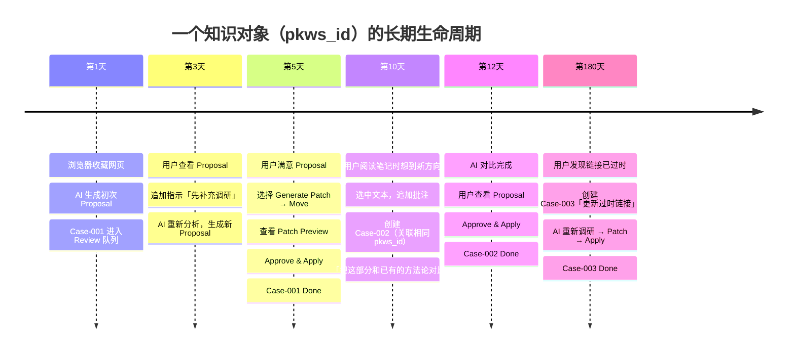

# 长期 Case 生命周期 timeline

> 对应文档：`docs/use-cases.md` §3 案例一、§7 案例五
> 说明：一个 Case 不是一次性对话，可以跨越数天到数周，甚至半年后关联新 Case



---

## 关键设计含义

### 笔记只存 `pkws_id`，不存 Case 信息

```
✅ 正确：
  ---
  pkws_id: kw_20260627_agent_workflow
  ---

❌ 错误：
  ---
  pkws_id: kw_20260627_agent_workflow
  cases:
    - case_001
    - case_002
  ---
```

### 同一个知识对象的多个 Case

| Case | 时间 | 动作 | 结果 |
|------|------|------|------|
| Case-001 | 第1天 ~ 第5天 | 初次整理 + Apply | 笔记移动到正式位置 |
| Case-002 | 第10天 ~ 第12天 | 补充对比 | 追加摘要 |
| Case-003 | 第180天 | 更新过时链接 | 修复内容 |

### 系统保持的状态

- `pkws_id` → 稳定锚点（写入笔记）
- `Knowledge Anchor` → 当前文件路径 + 历史
- `Case` → 每次独立的工作流任务
- `Timeline` → 所有事件的完整审计记录
- `Proposal` → 每次 AI 分析的建议（可丢弃）
- `Snapshot` → 每次 Apply 的备份（用于 Rollback）
