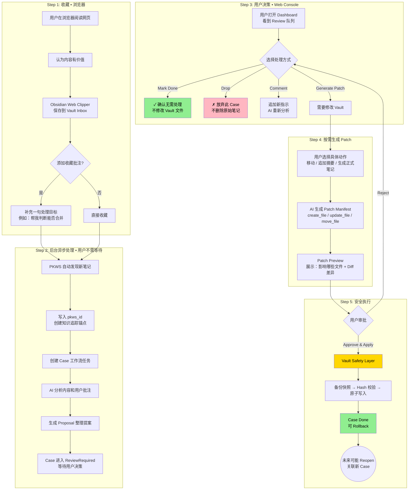

# 端到端用户业务流图：收藏 → 审批 → 归档

> 对应文档：`docs/use-cases.md`、`docs/interaction-design.md`
> 视角：用户视角，不包含系统内部技术细节

## 各步骤用户行为说明

| 步骤 | 用户做什么 | 在哪做 | 需要等多久 |
|------|-----------|--------|-----------|
| **Step 1 收藏** | 点击 Clipper 收藏，可选加批注 | 浏览器 | 即时完成 |
| **Step 2 异步处理** | 不用等，继续做其他事 | — | 几秒 ~ 几分钟 |
| **Step 3 决策** | 查看提案，决定 Mark Done / Drop / 深入处理 | Web Console | 几秒 |
| **Step 4 Patch** | 选择具体动作，预览变更 | Web Console | 几秒 ~ 几十秒 |
| **Step 5 Apply** | 审批，系统安全写入 | Web Console | 即时完成 |

## 关键设计约束

- **Proposal ≠ Patch**：AI 默认只生成 Proposal，只有用户选择具体动作后才生成 Patch
- **Mark Done 不修改 Vault**：用户确认原始笔记已经足够
- **Drop 不删除文件**：放弃处理但不删除内容
- **Apply 前必须 Preview**：用户必须看到影响文件列表和 Diff
- **Apply 后可 Rollback**：Vault Safety Layer 负责安全回滚
