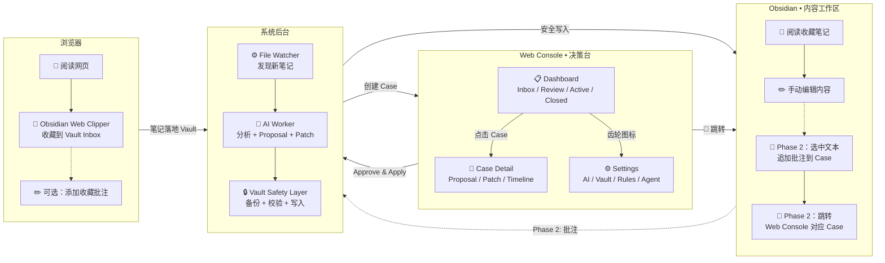

# 用户多触点交互职责图

> 对应文档：`docs/interaction-design.md`、`docs/architecture.md`
> 说明：三个用户可感知的界面各自负责什么，避免用户混淆"该去哪里操作"

## 核心分工

```
              ┌─────────────────────────────────────┐
              │          用户的一天                   │
              │                                      │
              │  • 浏览器 → 发现内容、收藏             │
              │  • Web Console → 决策、审批、配置       │
              │  • Obsidian → 阅读、编辑、批注          │
              └─────────────────────────────────────┘
```

---

### 详细职责流程



---

### 用户决策表

| 你要做什么 | 去哪里 | 入口 |
|-----------|--------|------|
| 收藏网页 | 浏览器 | Obsidian Web Clipper 扩展 |
| 查看有哪些未完成的 Case | Web Console | Dashboard |
| 看 AI 对这个收藏为什么建议这样处理 | Web Console | Case Detail → Proposal |
| 预览 Patch 会修改哪些文件 | Web Console | Case Detail → Patch Preview |
| 审批 / 拒绝 / 追加指示 | Web Console | Case Detail → 操作按钮 |
| 回滚一次系统写入 | Web Console | Case Detail → Rollback |
| 配置 AI Provider / Vault 路径 / 规则 | Web Console | Settings |
| 阅读整理后的笔记内容 | Obsidian | Vault 中对应文件 |
| 手动编辑笔记 | Obsidian | 直接在 Obsidian 中修改 |
| 选中文本追加批注（Phase 2） | Obsidian | 插件快捷键 |
| 查看轻量 Case 状态（Phase 2） | Obsidian | 插件状态卡 |

### 设计红线

```
❌ 不要在 Obsidian 中做完整审批
❌ 不要在浏览器中管理 Case
❌ 不要把 Proposal / Timeline 写入正文
❌ 不要把 Case 关系写进笔记 Frontmatter（只写 pkws_id）
```
